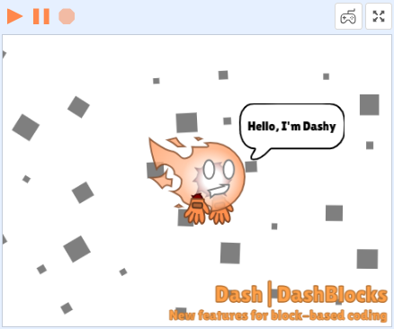
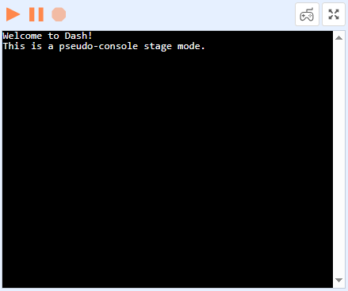

# Stage Mode

Changes the mode of the Scratch stage to one of these:

## 2D stage mode {#2d-stage-mode}

The 2D stage mode is a classic Scratch stage with sprites.

Example of a stage in 2D mode:

## Console stage mode {#console-stage-mode}

The console stage mode provides pseudo-console functionality and allows for text output using the "Console" block category.

:::caution
Console stage mode is useless for all projects created outside of Dash!
:::

Example of a stage in console mode:

:::note
The text in the example is displayed using the "Console" block category.
:::
